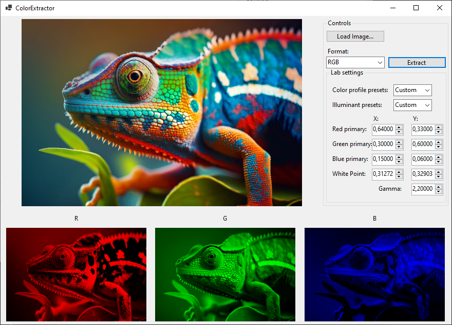
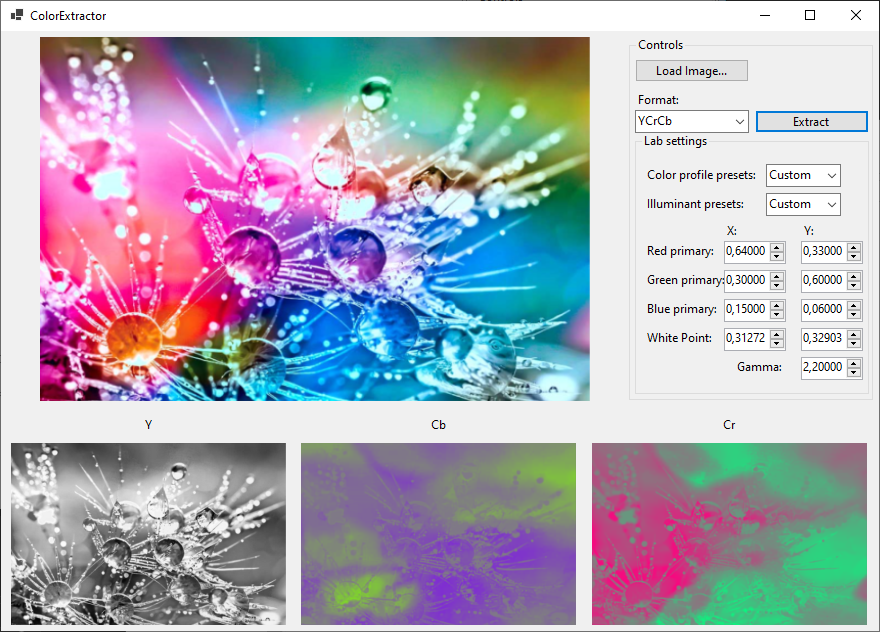
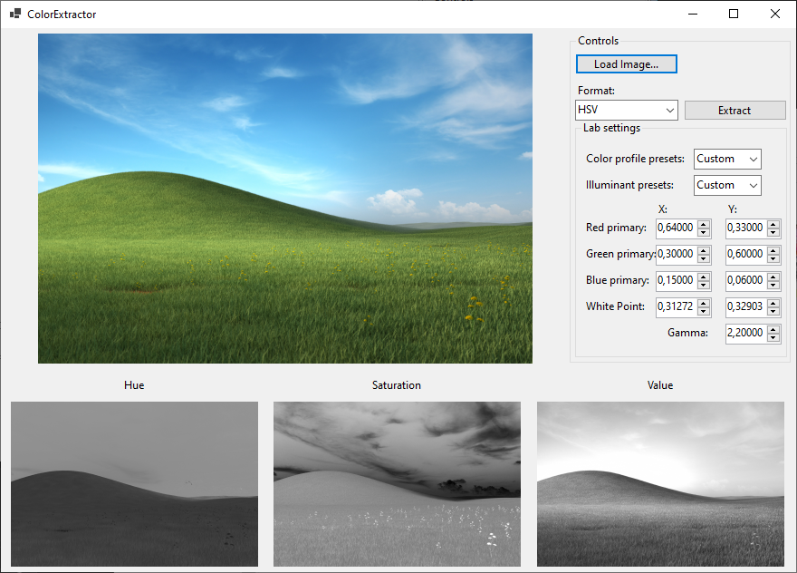
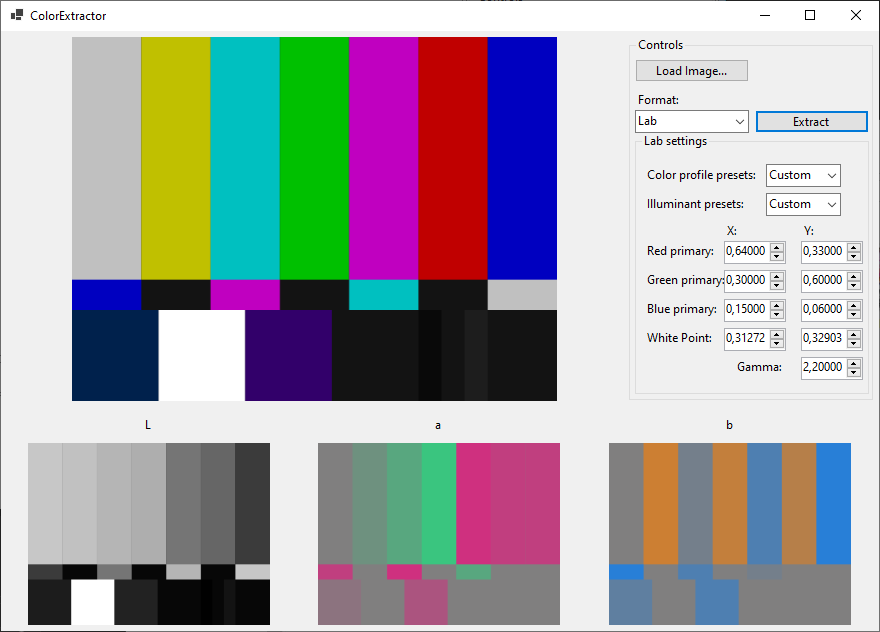

# ColorExtractor

ColorExtractor is an application for extracting and analyzing color components from images. It supports multiple color models and allows manipulation of color spaces for Lab model.

  

## Features

### Color Channel Decomposition
- Load an image and decompose it into its individual color channels.
- Supported color formats:
  - **RGB** (Red, Green, Blue)
  - **HSV** (Hue, Saturation, Value)
  - **YCbCr** (Luma, Chrominance-Blue, Chrominance-Red)
  - **Lab** (Lightness, a*, b*)

### Custom Color Spaces for Lab Model
- Choose from predefined color spaces:
  - **sRGB**
  - **AdobeRGB**
  - **Wide Gamut**
- Select from standard illuminants:
  - **D50**
  - **D65**
- Define a custom color space:
  - Set **Red, Green, and Blue primary coordinates**
  - Adjust **White Point**
  - Configure **Gamma correction**

  

## Usage
1. Load an image into the application.
2. Select a color model for decomposition.
3. View individual channels and analyze color distribution.
4. If using the Lab model, customize the color space settings if needed.

  

  

